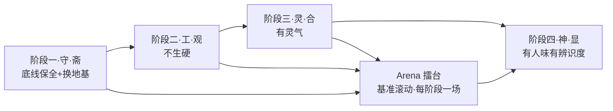

# 隐笔 · 落地计划 v0.2

> 四阶段路线（斋·观·合·显）+ Arena 评测协议 + 风险清单。执行约束见 [01-需求框架.md](01-需求框架.md) §5（低模型执行层）；哲学依据见 §4（魂纲目法用）。

---

## 0. 总路线图

**纪律：没有基准的改进都是自我感觉良好。** 每阶段打一场擂台，胜者成为新基线，封神就是基线滚动的轨迹。

## 1. "封神"的可验收定义

不搞玄学。梓庆的验收只有一条：见者惊犹鬼神。拆成五个可测信号：

| # | 信号 | 测法 | 背后 |
|---|------|------|------|
| 1 | 翻开三章能留人 | 翻页欲盲评 | 门的质量（时代为门） |
| 2 | 细节能被记住 | 读后复述测试：读完 10 分钟后让读者说出记得的画面 | 真的形状（从生命里漏出来的） |
| 3 | **同魂不同皮** | 三本书皮不同（题材/指纹/偏执点），读者仍能指认"同一个魂在疼同一处"（盲评问卷："是否同一人所写？他一直在写什么？"） | 皮书书不同，魂书书相同（魂档案） |
| 4 | 越写越有自己的东西 | 灵感台账转正率随章节上升 + 豁免消化率（神来之笔长出设定） | 世界自生长 |
| 5 | **十年测试** | 剥离时代性元素（梗/热词/即时情绪/套路 → 中性替换）后，细节留存依然通过 | 永恒为体——剩下的含量就是魂的含量 |

## 2. 阶段一「守」：底线保全 + 地基置换

**原则：动结构不动能力，先立基准再动手。** 工作量：1-2 个会话。

| 任务 | 内容 | 交付物 |
|------|------|--------|
| 同步上游 | sync worldwonderer/oh-story-claudecode（本地 fork 落后约一个月） | 最新代码 |
| 资产盘点 | 按 [01-需求框架.md](01-需求框架.md) §3 三清单执行：保留/降级/废弃 | 盘点清单 |
| SKILL.md 瘦身 | 649 行 → <150 行：场景路由 + 3-5 条不变式（如"对话要么推进要么揭示"）+ 文件契约；references 34 份移入咨询库，不进主流程 | 瘦身版 SKILL.md |
| 任务卡模板库 | 写作卡 / 自检卡 / 发散卡 / 改写卡 四卡定义 + 样例（每张 <500 token） | `skills/story-write/cards/` |
| **建立基准** | 固定 3 个测试场景：同一开书指令、同一章细纲（可取 demo《盘龙》）、同一续写场景。用**原框架 + 锁定执行模型**跑出 3 章基准样本 | `arena/基准/` |

**验收**：原 demo 流程全跑通（开书→细纲→写章→检查）；一致性/字数护栏零回退；基准样本落盘。

## 3. 阶段二「工」：工艺扩充，产出"不生硬"

工作量：2-3 个会话。

| 任务 | 内容 |
|------|------|
| 范文教学 | 参数化题材卡 → 范文切片库：每题材 3-5 段 500-1000 字成品片段（从对标书原文切片） |
| 声线连续性 | 上一章结尾 300 字原文直接贴卡 + 文气三行（结尾节奏/情绪余韵/悬置张力） |
| 重写回路 | 成稿 → 自检卡是非题扫描 + 编排层标问题 → 段落级定向改写卡（原段+具体问题+改写方向+好坏对照例）；分级执行：只重写关键 beat，控成本 |
| 两遍生成 | 草稿卡 → 改写卡（编辑视角） |

**验收（擂台 1）**：同细纲，新框架 vs 基准各写一章，执行层锁同一低模型；盲评"想不想读下去"胜出；外部 AI 检测分作参考曲线（不作主判据）。

## 4. 阶段三「灵」：灵性注入，产出"有灵气"

工作量：3-4 个会话。

| 任务 | 内容 |
|------|------|
| 六个灵感装置 | `references/muse/` 操作卡：5选1发散收敛、感官骰子、物件前史、角色两问、闲笔配额、人物之眼比喻（每装置附好坏对照例） |
| 双模式系统 | Craft 默认 / Muse 机械判据升档（细纲标签/章号/用户指令）；连续 Muse ≤3 章自动回落 |
| 灵感台账 | `追踪/灵感台账.md` 固定格式登记细纲外新元素，下批细纲时决定转正 |
| 质感拆解 Stage | 拆文管道新增输出：质感卡（细节选择习惯/比喻来源域/闲笔形态/对话呼吸/情绪落点） |
| 类型魂谱 | 拆文管道新增输出：类型魂谱（核心渴望/核心恐惧/经典叩问/隔代同构书目），魂档案的经线（§7.7） |
| 气卡机制 | 气卡三字段（气句/底色/收放）+ 三栖息地（外选隐函数/细纲底色/豁免第四票）；合问进选择器（§7.4） |

**验收（擂台 2）**：灵气盲评（作者 + 换模型当读者 + 可选朋友）胜率 >60%；一致性 checker 零回退——**灵性不许以崩设定为代价**。

## 5. 阶段四「神」：作者性注入，冲击封神

工作量：持续滚动（口述积累是生活方式，不是任务）。

| 任务 | 内容 |
|------|------|
| 多源质感合成 | 3-5 本同题材书质感卡加权混合 + 开卷随机扰动，皮不同味 |
| 作者魂档案 | 一生之问 / 私人切口 / 历次气句 / 回响收编（§7.7）；跨书第一资产——指纹每书可换，魂档案不变 |
| 作者指纹 + 偏执点 | 开书时定指纹（比喻域/镜头习惯/闲笔频率）+ ≤2 条全书偏执；每张写作卡物理重复 |
| 口述采集 | 经验访谈模式：AI 提问、作者口述两句、AI 整理入 `灵感池/` |
| 豁免机制 | checker 报警拦截待审（永不自动删）+ 五测试 + 豁免台账 + 每卷 ≤2 限额 + 设定回写消化（§7.8） |
| 气的复述 | 每 N 卷作者口述重说气句，刷新气卡，历史入魂档案——防气变口号 |
| 糙感保留 | 改写卡指令"宁留三分糙，不磨十分滑"；lint 只清确定性错误 |
| 复利飞轮 | 章评/读者数据回流下批细纲；每本书结束出复盘报告，指纹参数迭代 |

**验收（封神测试）**：

1. **辨识度**：三本书用不同指纹各写三章开头，读者能区分"不是同一个作者写的"；
2. 偏执点在成品中可被读者指认（"这书总在暴力后写吃的"）；
3. 灵感台账转正率持续上升；
4. 翻页欲盲评对旧基线稳定胜出。

## 6. Arena 擂台评测协议

| 项 | 规则 |
|----|------|
| 对手 | 挑战者 = 当前阶段框架版本；卫冕者 = 上一版基线 |
| 题目 | 同一细纲（固定 3 个测试场景轮换） |
| 执行 | 双方执行层锁同一低模型（从第一场起就在真实战场打） |
| 盲评维度 | 翻页欲（想不想读下去）/ 细节留存（10 分钟后记得什么）/ AI 味 / 灵气 / **合问**（这一章是更"合"，还是只是更"合格"） |
| 评委 | 作者本人（主）+ 换一个模型当读者（辅）+ 可选朋友 |
| 判定 | 胜者成为新基线，落盘 `arena/`，附对战记录（日期/版本/票数/评语） |
| 频率 | 每阶段至少一场，目标每 2-3 周一场 |

## 7. 风险清单

| 阶段 | 最大坑 | 护栏 |
|------|--------|------|
| 守 | 瘦身过度丢能力 | 基准回归测试，每改必跑 |
| 守 | 低模型跑不动新流程 | 卡片化改造全覆盖，主流程不出现 >500 token 的自由指令 |
| 工 | 重写回路烧 token，日更成本翻倍 | 分级重写：只重写关键 beat；粒度参数自适应 |
| 灵 | 灵感装置失控崩设定 | 台账收编 + checker 扫描 + Muse 密度上限 |
| 灵 | 低模型发散质量不足 | 5选1带分类提示；多采样外选兜底 |
| 神 | 偏执点变强行风格化 | 偏执 ≤2 条；口述素材只注入不强插 |
| 神 | 豁免被滥用成免死金牌 | 每卷 ≤2 处 + 五测试 + 台账留痕；消化测试不通过则回滚 |
| 神 | 魂档案僵死成开书模板 | 一生之问开书不定稿、试写 3 章后回填；回响收编持续修订 |
| 灵 | 气句变成口号贴墙 | 永不下发任务卡；每 N 卷复述刷新；气句措辞禁对仗禁修辞 |
| 全程 | 哲学语言被中低档模型误读变形 | 操作化身双语制（§4.4）：进流程的只有是非题/固定字段/判词，零理解需求 |
| 全程 | 在强模型上调好后到低模型上全崩 | 执行层从第一场擂台起锁死低模型 |

## 8. 执行粒度自适应

同一框架，按执行层模型分档：

| 执行层 | 粒度 | 模式 |
|--------|------|------|
| 强模型（Opus 级） | 一次一章 | 编排层少拆步骤 |
| 中档模型 | 一次半章 | 中间粒度 |
| **低模型（deepseek-flash 级，默认档）** | **一次一 beat（500-1500 字）** | 全卡片化 + 多采样外选 |

粒度参数写在项目配置（`作者性/指纹.md` 同级），框架读配置组装任务流。

## 9. 立刻可做的第一步（三选一）

1. **同步 fork + 盘点清单 + 跑基准样本**——阶段一全量启动，产出 `arena/基准/`；
2. **先写新版 SKILL.md 骨架**（<150 行）+ 四张任务卡模板初版——先过设计再动代码；
3. **先定测试题材和基准细纲**——擂台用什么书打，作者说了算。

> 推荐顺序：3 → 1 → 2。先定擂台题目（题材+细纲），基准才有意义；但三者任一可直接开工。

---

*版本 v0.2 · 封神定义升级五信号（同魂不同皮/十年测试）、新增魂谱/气卡/豁免/魂档案工作项与风险 · 与 [01-需求框架.md](01-需求框架.md) 同步修订 · 对战记录落盘于 `arena/`*
